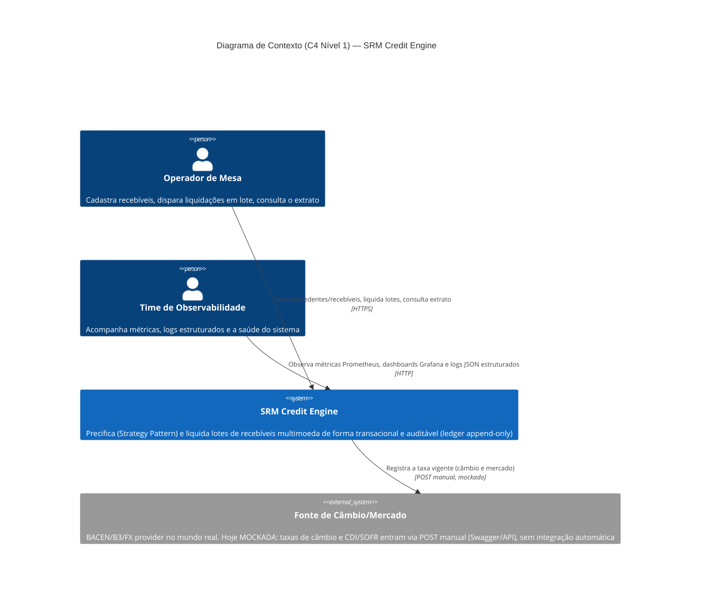
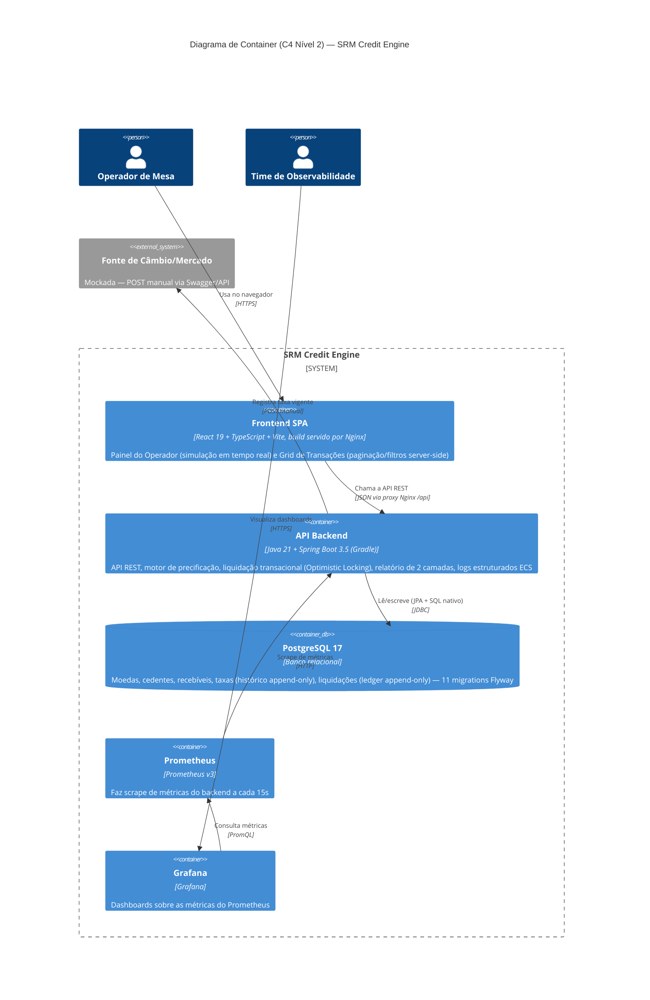

# Diagrama C4 — SRM Credit Engine

Diagramas de arquitetura nos níveis 1 (Contexto) e 2 (Container), exigidos explicitamente pelo desafio no nível Sênior (`CLAUDE.md`, seção 6). Renderizados via Mermaid (mesma convenção de [`docs/diagrama-er.md`](./diagrama-er.md)) — GitHub renderiza os blocos abaixo automaticamente ao visualizar este arquivo.

Reflete o estado real do sistema em 2026-07-04 (ver `ROADMAP.md`), não um estado aspiracional — inclusive as peças que hoje são mockadas/manuais estão marcadas como tal.

## Nível 1 — Contexto

Quem usa o sistema e com o que ele conversa por fora dos seus próprios limites.

**Fora do escopo do diagrama de propósito**: não há nenhum outro sistema externo automatizado (nenhum ERP, nenhum sistema de pagamento, nenhum provedor de auth) — o sistema hoje não tem autenticação/autorização (ver [`docs/criterios-aceite.md`](./criterios-aceite.md), seção Segurança).

## Nível 2 — Container

Zoom pra dentro do `SRM Credit Engine`: as peças deployáveis e como conversam entre si. Mapeia 1:1 com os serviços do `docker-compose.yml` da raiz.

### Notas sobre containers que não aparecem

- **Sem API Gateway / Load Balancer**: um único backend, uma única instância — não há necessidade hoje (ver `docs/criterios-aceite.md`, Escalabilidade, pra discussão sobre múltiplas réplicas).
- **Sem message broker / fila**: o lote de recebíveis é processado de forma síncrona dentro da própria requisição HTTP (`LiquidacaoBatchService`) — um gap conhecido de escalabilidade pra lotes muito grandes, documentado em `docs/criterios-aceite.md`.
- **Sem Loki/ELK/Graylog**: os logs estruturados (ECS) hoje só vão pro stdout do container (`docker compose logs backend`) — não há um coletor/agregador de logs rodando. ECS foi escolhido justamente por ser o formato nativo de um eventual Grafana Loki, caso esse container seja adicionado no futuro (ver `ROADMAP.md`, Passo 8). O acesso do time de observabilidade aos logs hoje é via CLI direto no host (`docker compose logs`), não uma chamada de container pra container — por isso não aparece como uma seta no diagrama acima.
